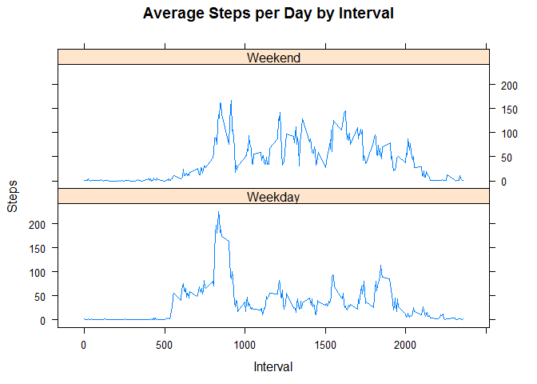

# Reproducible Research: Peer Assessment 1

## Loading and preprocessing the data

Load the activity.csv file
  

```r
   activity <- read.csv("activity.csv")
```

## What is mean total number of steps taken per day?

Calculate the total number of steps taken per day
    

```r
    stepsbyday <- aggregate(steps ~ date, activity, sum)
```
    
Make a histogram of the total number of steps taken each day


```r
    hist(stepsbyday$steps, main = paste("Total Steps Each Day"), col="blue", xlab="Number of Steps")
```

 
    
Calculate and report the mean and median of the total number of steps taken per day    
    

```r
    rmean <- mean(stepsbyday$steps)
    rmedian <- median(stepsbyday$steps)
```
The Mean is 10766
The median is 10765

## What is the average daily activity pattern?

Time series plot (i.e. type = "l") of the 5-minute interval (x-axis) and the average number of  steps     taken, averaged across all days (y-axis)
     

```r
     stepsbyinterval <- aggregate(steps ~ interval, activity, mean)
     plot(stepsbyinterval$interval,stepsbyinterval$steps, type="l", xlab="Interval", ylab="Number of Steps",main="Average Number of Steps per Day by Interval")
```

 

Maximum number of steps

```r
     maxinterval <- stepsbyinterval[which.max(stepsbyinterval$steps),1]
```

## Imputing missing values

Total number of missing values in the dataset (i.e. the total number of rows with NAs)
     

```r
     incomplete <- sum(!complete.cases(activity))
```
Total number of missing values is 2304
    
Devise a strategy for filling in all of the missing values in the dataset.

```r
     imputeddata <- transform(activity, steps = ifelse(is.na(activity$steps), stepsbyinterval$steps[match (activity$interval, stepsbyinterval$interval)], activity$steps))
     imputeddata[as.character(imputeddata$date) == "2012-10-01", 1] <- 0
    stepsbydayi <- aggregate(steps ~ date, imputeddata, sum)
```
Make a histogram of the total number of steps taken each day


```r
     hist(stepsbydayi$steps, main = paste("Total Steps Each Day"), col="blue", xlab="Number of Steps")
```

 

Create Histogram to show difference. 


```r
     hist(stepsbyday$steps, main = paste("Total Steps Each Day"), col="red", xlab="Number of Steps")
     legend("topright", c("Imputed", "Non-imputed"), col=c("blue", "red"), lwd=10)
```

 

Mean and median total number of steps taken per day. 


```r
     rmean.i <- mean(stepsbydayi$steps)
     rmedian.i <- median(stepsbydayi$steps)

     meandiff <- rmean.i - rmean
     meddiff <- rmedian.i - rmedian

     totaldiff <- sum(stepsbydayi$steps) - sum(stepsbyday$steps)
```
         
Mean of total number steps per day is 10766
Median of total number steps per day is 10766

The imputation was changed from 10765 to 10766 and slightly impacted on the median total number of steps taken per day. The mean total number of steps taken per day remained the same.
     

## Are there differences in activity patterns between weekdays and weekends?


```r
     weekdays <- c("Monday", "Tuesday", "Wednesday", "Thursday","Friday")
     imputeddata$dow = as.factor(ifelse(is.element(weekdays(as.Date(imputeddata$date)),weekdays), "Weekday", "Weekend"))
     stepsbyintervali <- aggregate(steps ~ interval + dow, imputeddata, mean)
     library(lattice)
```
Panel plot containing a time series plot (i.e. type = "l") of the 5-minute interval (x-axis) and the average number of steps taken, averaged across all weekday days or weekend days (y-axis)


```r
     xyplot(stepsbyintervali$steps ~ stepsbyintervali$interval|stepsbyintervali$dow,main="Average Steps per Day by Interval",xlab="Interval", ylab="Steps",layout=c(1,2), type="l")
```

 


